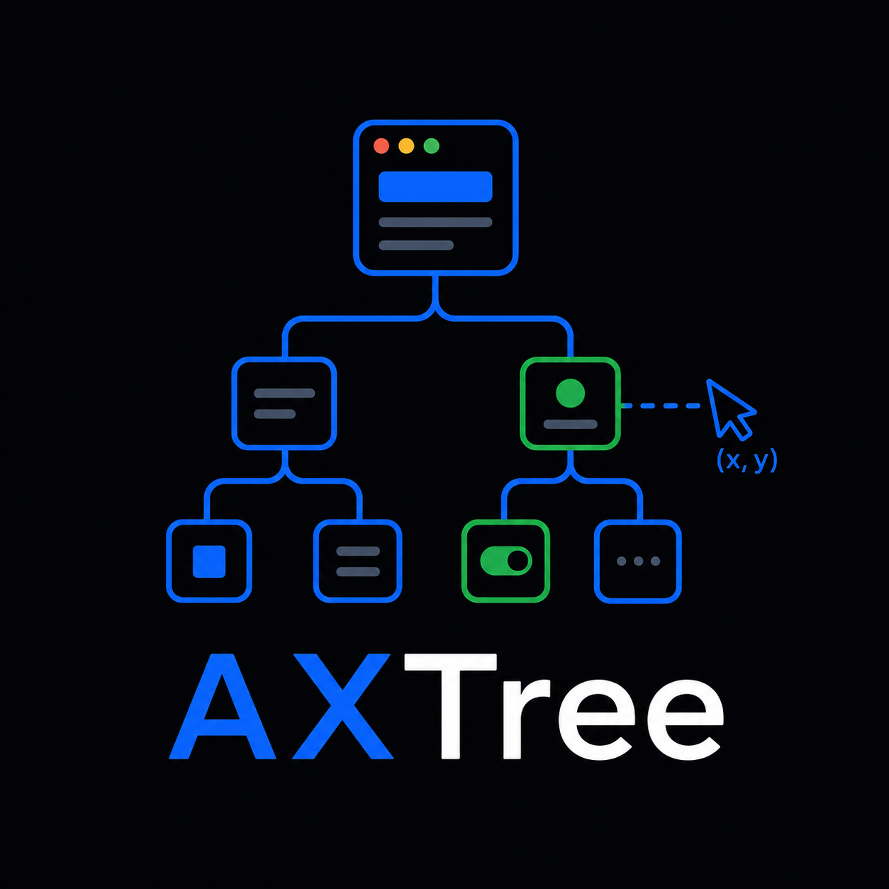

<p align="center">
  
</p>

# AXTree API

[](https://github.com/amaar-mc/axtree-api/actions/workflows/ci.yml)
[](LICENSE)

Event-driven macOS computer use for agents.

AXTree API watches the macOS Accessibility tree, waits for the UI to settle, and gives Python agents a small action map of real controls: labels, roles, bounds, focus state, and click-ready coordinates. It can also send `click`, `type`, and `keyPress` commands back to the desktop.

It is a developer preview, but the core loop works against real macOS apps today.

## Install

Requirements:

- macOS
- Swift toolchain
- Python 3.11+
- Accessibility permission for the terminal or IDE running the daemon

Grant permission in:

```text
System Settings > Privacy & Security > Accessibility
```

Then:

```bash
python3 -m pip install -e .
swift build --arch arm64
examples/calculator_quickstart.py
```

The quickstart opens Calculator, clicks `9 + 1`, presses Return, and prints the display value.

## Use

```python
import subprocess
import time

from axtree_api import ActionAPI, DaemonManager

subprocess.run(["open", "-a", "Calculator"], check=True)
time.sleep(1)

with DaemonManager() as manager:
    actions = ActionAPI(manager)
    state = manager.wait_for_state(app_name="Calculator", timeout=15)

    nine = state.find(
        role="AXButton",
        predicate=lambda element: element.label in {"9", "Nine"},
    )
    if nine is None:
        raise RuntimeError("Could not find the 9 button")

    actions.click_element(nine)
    actions.key_press("return")
```

Other actions:

```python
actions.click(x, y)
actions.type_text("Hello World")
actions.key_press("f", modifiers=["command"])
actions.key_press("escape")
```

## How It Works

```text
macOS app
  -> AXObserver events
  -> 300 ms debounce
  -> filtered Accessibility tree
  -> JSON state stream
  -> Python UIState
  -> click/type/keyPress command
```

The daemon emits newline-delimited JSON over stdout and accepts newline-delimited commands over stdin.

Example node:

```json
{
  "role": "AXButton",
  "description": "All Clear",
  "x": 759,
  "y": 381,
  "width": 60,
  "height": 48,
  "centerX": 789,
  "centerY": 405,
  "focused": false
}
```

Example commands:

```json
{"action":"click","coordinates":[789,405]}
{"action":"type","text":"Hello World"}
{"action":"keyPress","key":"return"}
{"action":"keyPress","key":"f","modifiers":["command"]}
```

## Vision Fallback

Most useful controls are exposed directly by Accessibility. For unlabeled icon-only controls, AXTree can crop the element's bounds with `screencapture -R` and hand that image to your own vision provider:

```python
from axtree_api import capture_element_screenshot, get_semantic_label_from_vision

image_path = capture_element_screenshot(element)
label = get_semantic_label_from_vision(image_path, provider=my_vision_provider)
```

No vision model is bundled.

## Verify

```bash
python3 -m compileall axtree_api examples scripts
swift build --arch arm64
scripts/test_calculator_state.py
scripts/test_python_calculator.py
scripts/test_keyboard_command.py
scripts/test_calculator_complex_expression.py
scripts/test_vision_fallback.py
scripts/evaluate_notes_e2e.py
```

The GUI scripts control foreground macOS apps. Run them sequentially.

## Limits

- Tracks the frontmost app/window.
- Element ids are path-based, not persistent object ids.
- Actions are intentionally small: `click`, `type`, `keyPress`.
- Vision fallback is a hook, not a built-in model.
- GUI tests require macOS Accessibility permissions.

## Project

- Swift daemon: `Sources/AXTreeDaemon/main.swift`
- Python API: `axtree_api/core.py`
- Vision fallback: `axtree_api/vision.py`
- Example: `examples/calculator_quickstart.py`
- Local checks: `scripts/`

MIT licensed. See `CONTRIBUTING.md` and `SECURITY.md` before contributing.
